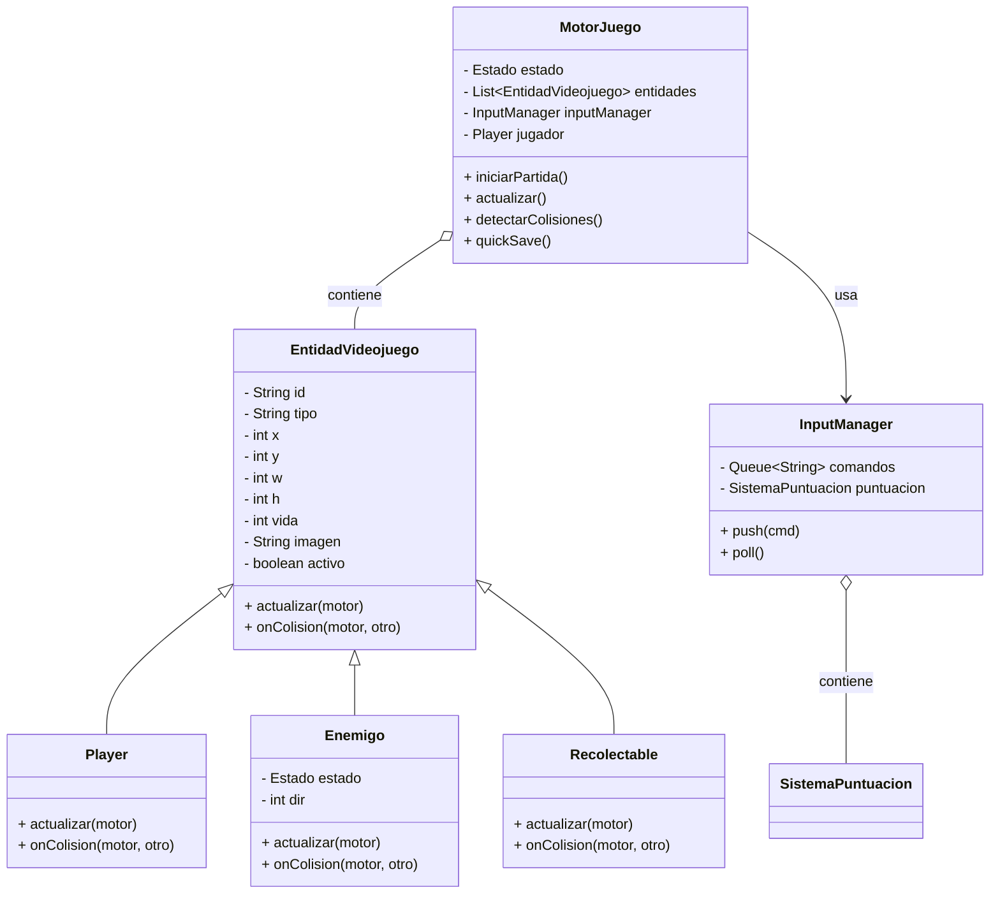

# Mini-Motor 2D - Tema: Explorador Espacial (Simulación por consola)

Breve: Simulación de un micro-motor 2D para un juego de exploración espacial. Se incluyen jugador, enemigos y objetos recogibles. El objetivo del repositorio es demostrar modelado, tests por consola y documentación (UML + casos de uso).

## Arquitectura

Clases principales (máx. 6):
- `Main`: Simula entradas y ejecuta el bucle.
- `MotorJuego`: Controla estados, entidades y bucle.
- `EntidadVideojuego`: Clase abstracta base para entidades.
- `Player`: Jugador controlado por entradas.
- `Enemigo`: NPC con comportamiento patrullar/perseguir.
- `Recolectable`: Objetos que otorgan puntos/vida.
- `InputManager` (contiene también `SistemaPuntuacion`) - gestiona comandos simulados.

### Justificación
Se mantuvo un diseño orientado a objetos mínimo con encapsulación (atributos privados y getters/setters). `MotorJuego` centraliza la lógica del bucle y la detección de colisiones AABB.

## Diagramas UML

### Diagrama de clases (Mermaid)



### Diagrama de casos de uso (Mermaid)

```mermaid
%% Actor Jugador interactúa con MotorJuego
usecaseDiagram
  actor Jugador
  Jugador --> (Iniciar partida)
  Jugador --> (Mover jugador)
  Jugador --> (Guardar partida rápida)
  Jugador --> (Pausar / Reanudar)
  (Iniciar partida) .> MotorJuego : usa
```

## Casos de Uso (2 especificados)

Tabla obligatoria:

Nombre: CU-01 Iniciar Partida
Objetivo: Permitir al jugador iniciar una nueva partida y generar entidades iniciales.
Actor Principal: Jugador
Precondiciones: El motor no está en estado JUGANDO.
Flujo Principal: 1) Jugador solicita iniciar partida. 2) Motor limpia entidades, crea `Player`, enemigos y recolectables. 3) Motor cambia estado a JUGANDO.
Flujos Alternativos: Si ya hay una partida en curso, el sistema notifica y no reinicia.
Postcondiciones: Estado = JUGANDO; entidades iniciales cargadas.
Reglas de Negocio: No se puede iniciar si el estado es JUGANDO.

Nombre: CU-02 Recolectar Objeto
Objetivo: El jugador recoge un `Recolectable` y obtiene puntos/vida.
Actor Principal: Jugador
Precondiciones: El objeto y el jugador existen y están en posiciones colisionantes.
Flujo Principal: 1) El jugador se mueve a la casilla del objeto. 2) El motor detecta la colisión. 3) Se ejecuta `onColision`: el objeto se desactiva, se suma puntuación y se incrementa la vida.
Flujos Alternativos: Si el objeto ya fue recogido, no ocurre nada.
Postcondiciones: El `Recolectable` eliminado; puntos añadidos; vida del jugador actualizada.
Reglas de Negocio: Un recolectable solo puede otorgar premio una vez.

## Bitácora de Uso de IA

- Herramienta utilizada: ChatGPT (asistente para generación de código y documentación). Rol: co-desarrollador que propone diseño, genera código y corrige errores.

- Prompts (ejemplos exactos usados durante creación):
  1) "Genera en Java una clase abstracta EntidadVideojuego con coordenadas, tamaño, vida, imagen y métodos actualizar() y onColision()."
  2) "Escribe MotorJuego que mantenga una lista de EntidadVideojuego, un input manager, detecte colisiones AABB y tenga quickSave() que retorne el estado como string."

- Control de errores de la IA: Inicialmente la IA sugirió más de 10 clases; se le ordenó limitarse a máximo 6 clases. También propuso usar serialización binaria para save; lo cambié a un string formateado para simplificar y cumplir requisitos.

- Reflexión crítica: La IA acelera la creación del esqueleto y los diagramas, pero puede sobre-diseñar (crear demasiadas clases) o asumir librerías externas. Bajo presión, conviene revisar y restringir la arquitectura y ejecutar pruebas rápidas.

## Cómo compilar y ejecutar (Windows PowerShell)

1) Compilar:

```powershell
javac src\*.java
```

2) Ejecutar:

```powershell
java -cp src Main
```

## Pruebas realizadas

- Ejecuté la simulación por consola con 10 ticks. Se comprobó: cambio de estado, movimiento de enemigos, detección de colisiones y quicksave.

## Sugerencias futuras

- Exportar `quickSave` a JSON real.
- Añadir más estados y un sistema de eventos.
